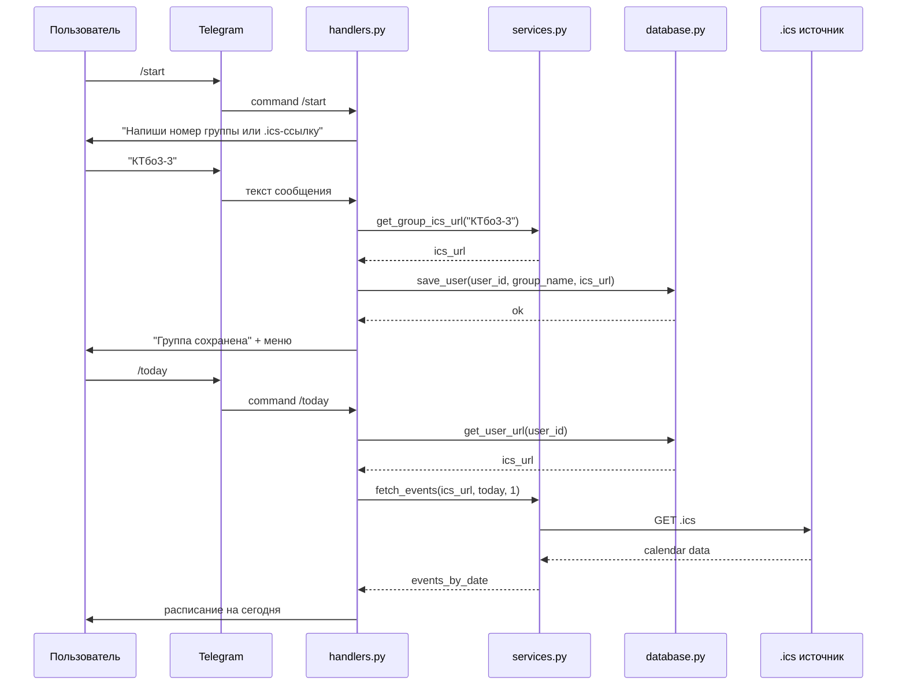
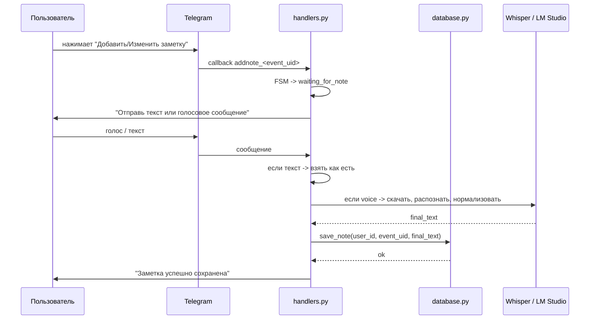

# 06. Sequence-диаграммы

## 1. Пользователь вводит группу - бот показывает расписание

## 2. Пользователь добавляет заметку к паре

## последовательность

- `handlers.py` управляет диалогом и состоянием.
- `services.py` отвечает за внешние данные и распознавание.
- `database.py` хранит привязку группы и заметки.
- Внешний `.ics`-источник отделён от Telegram-слоя.

